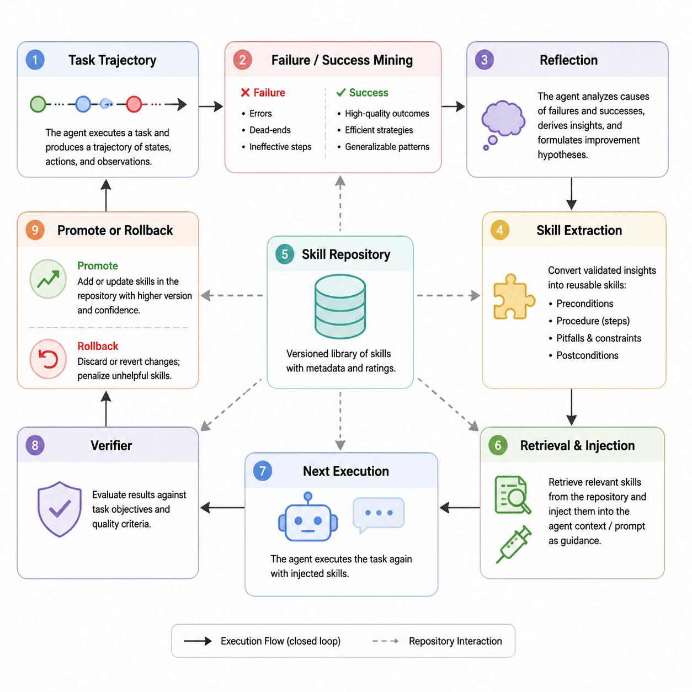
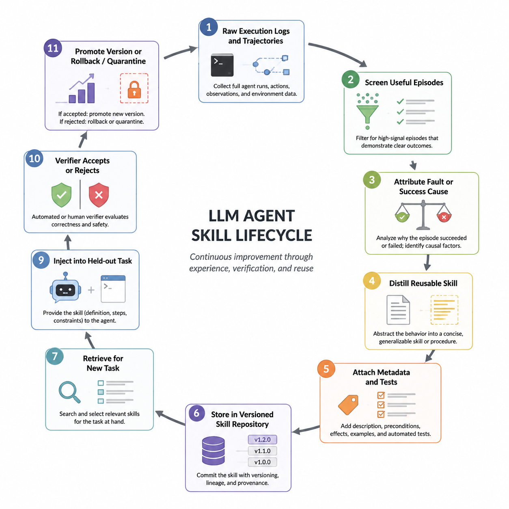

# Agent 自进化、技能沉淀与轨迹学习研究综述

## 摘要

LLM agent 研究正在从“把大模型接上工具完成一次任务”转向“让 agent 从持续交互中积累可复用能力”。这个转向的核心不只是加一个向量库或反思 prompt，而是形成一个可审计的闭环：任务执行产生轨迹，轨迹被筛选、归因和抽象，抽象结果以记忆、反思、技能、检索器训练信号、prompt/代码补丁或模型参数更新的形式沉淀，再通过检索、注入、验证和回滚机制进入后续任务。现有文献大致形成五条路线：反思与经验学习、长期记忆、技能库与技能生命周期、轨迹监督/轨迹到技能、自训练或强化学习式自进化。对 PrincipiaBlastFoam 第 4 章而言，最直接可借鉴的是“从失败轨迹沉淀技能，并用确定性验证器控制技能进入生产链路”的工程化路线。

## 图示框架

图 1 展示了 agent 自进化闭环：任务轨迹经过失败/成功模式挖掘、反思、技能抽取和技能库版本化后，通过检索与注入影响下一次执行，并由验证器决定推广或回滚。

图 2 展示了技能沉淀生命周期：从原始执行日志和轨迹开始，经 episode 筛选、成败归因、技能蒸馏、元数据与测试绑定、版本化入库、检索注入和 held-out 验证，最终形成可审计的版本推广或隔离机制。

## 1. 概念边界：自进化不等于一次性自我纠错

“自进化”在文献中有宽窄两种用法。宽义上，它包括模型从自生成数据、自反馈或自博弈中更新参数，例如 Self-Rewarding Language Models、SPIN、R-Zero、Agent0、COSE 和 TTRL。狭义上，它指 agent 系统在不更新基础模型权重的情况下，更新外部组件：记忆、技能库、工具说明、检索器、系统提示词、执行脚手架或评测器。第 4 章的“技能沉淀”更接近狭义路线，因为它把 Chapter 3 的失败证据转为可检索、可注入、可验证的技能，而不是训练一个新模型。

Tao 等的 LLM 自进化综述把循环拆成经验获取、经验精炼、更新和评估四步；Gao 等的 self-evolving agents 综述进一步追问 what/when/how：更新什么组件、在测试时还是跨任务阶段更新、用标量奖励还是文本反馈更新。技能相关综述则把 skill 从 tool 中分离出来：tool 往往是单个函数调用，skill 是带有适用条件、步骤、资源、测试和治理规则的过程性知识包。这个区分对工程系统很关键，因为 blastFoam/OpenFOAM 任务中的“技能”通常不是一个 API，而是跨文件、跨日志、跨物理约束的操作规程。

## 2. 基础范式：从 ReAct 轨迹到可学习的 agent 日志

ReAct 奠定了 Thought-Action-Observation 的轨迹格式，使 agent 行为变成可记录、可复盘、可训练的序列。MRKL、Toolformer、API-Bank、ToolLLM、Gorilla、HuggingGPT 等工作则证明 LLM 可以选择、调用和组合外部工具。WebGPT、WebShop、WebArena、OSWorld、AppWorld、SWE-bench、GAIA 和 AgentBench 等评测把 agent 放进多步环境，要求模型面对状态变化、工具错误、网页/文件系统反馈和最终任务验收。

这些工作本身未必“自进化”，但它们提供了自进化的燃料：完整轨迹、工具调用、环境反馈、失败原因和成功路径。没有这些可追踪中间证据，后续的 Reflexion、ExpeL、ReST meets ReAct、Trace2Skill、SkillOS 等方法都只能停留在最终答案级别的自我纠错，无法判断到底是哪一步、哪个工具、哪条技能导致成败。

## 3. 反思与经验学习：把失败变成文字经验

Reflexion 是这一脉络的关键起点。它不更新模型参数，而是让 agent 根据任务反馈写出 verbal reflection，并把反思放入 episodic memory 供下一次尝试使用。Generative Agents 将观察、反思和计划组织为 memory stream，说明自然语言记忆可以支撑长期行为一致性。Voyager 则把反思推进到可执行技能库：Minecraft 中成功的代码片段被保存为技能，后续可检索和组合。ExpeL 进一步系统化了“从训练任务经验中抽取自然语言知识，再迁移到测试任务”的流程。

后续研究开始追问反思的质量。Retroformer 学习 retrospective model 来根据环境反馈优化 agent prompt；MetaReflection 从过去反思中学习更好的指令；Devil's Advocate 把反思前置为 anticipatory reflection；Self-Reflection in LLM Agents 和 Positive Experience Reflection 分析反思在不同任务和正/负经验上的作用。ReasoningBank、RetroAgent、CLEAR、BenchTrace 等 2025-2026 年工作则把反思从“单条经验总结”推进到“跨轨迹经验库”和“受控演化评测”：既抽取成功策略，也抽取失败避坑点，并检验这些经验是否真的改变后续行为。

这条路线的优点是成本低、可解释、与闭源模型兼容。缺点也明显：反思容易生成表面合理但不可执行的建议；长反思会污染上下文；如果没有验证器，错误经验会被反复强化。对工程 agent 来说，反思不能只写“检查边界条件”，而应落到具体文件、日志模式、物理量范围、可运行命令和验收条件。

## 4. 长期记忆：从追加日志到可治理的记忆操作

MemoryBank、MemGPT、Mem0、PlugMem、AgeMem、Memory-R1、TA-Mem 等工作体现了长期记忆路线的演化。早期系统多是把对话或任务片段存入向量库，按相似度召回；MemGPT 把记忆管理显式化为类似操作系统的分层存储；Mem0 和 PlugMem 关注生产环境下的可扩展、低冗余和知识图式化；AgeMem 和 Memory-R1 则把“写入、更新、删除、保留”变成 agent 可学习的动作。

记忆系统和技能系统的差别在于粒度和验收方式。记忆回答“过去发生了什么、用户偏好是什么、哪些经验可能相关”，技能回答“遇到这类问题应该按什么步骤做，如何判断做对了”。How Memory Management Impacts LLM Agents 指出 retrieved memory 会诱导 agent 复制相似输出，这说明记忆不仅是信息来源，也是策略偏置源。EvoMemBench、MemoryAgentBench、LongMemEval-V2 等评测开始要求记忆系统处理跨 episode 经验、冲突更新和长期一致性。

对 PrincipiaBlastFoam，记忆层适合保存项目级事实和历史算例证据，例如求解器版本、典型边界条件、已验证教程、日志错误模式；技能层则适合保存“当 `rho`/`thermophysicalProperties` 不一致时如何修复并验证”这类程序性规程。二者应分层，避免把所有经验都塞进一个不可控向量库。

## 5. 技能沉淀：从 Voyager 技能库到 SkillOS/Trace2Skill

技能路线是当前与“技能沉淀”最贴近的方向。Voyager 展示了自动课程、迭代代码生成和增长式技能库的组合；AutoSkill 将用户交互轨迹抽象为可复用技能，并动态注入未来请求；Trace2Skill 将大量执行轨迹并行归纳成统一技能目录，强调技能不是记忆具体案例，而是压缩失败模式和操作规程；SkillOS 将“技能库维护”本身建模为可学习策略，由 curator 决定何时新增、修改和保留技能；CoEvoSkills 用 skill generator 和 surrogate verifier 共同进化来构建复杂多文件技能包；SkillFoundry 从科学资源、脚本、API、文档和论文中挖掘过程性知识，生成带 provenance 和 tests 的技能。

这批论文共同说明，技能质量取决于三个环节：经验池、抽取器、消费者。SkillLens 的经验尤其重要：好看的技能文本不一定有用，LLM judge 对技能优劣的判断可能低于随机；真正有用的是具体失败机制、可执行补救步骤和高风险动作黑名单。SkillAdaptor 进一步把更新粒度细化到失败轨迹中的第一个可行动故障步骤，并用 acceptance checks 防止过宽更新。SAGE 和 MUSE-Autoskill 则把技能库纳入强化学习或生命周期管理，关注长期任务流中的技能创建、记忆、管理、评估和修订。

这对第 4 章有直接启发：技能不是“总结得越抽象越好”。抽象技能能提升覆盖面，但如果缺少故障归因、触发条件和验收步骤，容易变成泛泛提示；具体 verifier skill 虽然窄，但能在 OpenFOAM/blastFoam 这种强约束环境中减少虚假改进。当前项目中 concrete-verifier-skill 组优于 no-skill 和 abstract-skill 组，正好与 SkillLens、Trace2Skill、SkillAdaptor 的结论一致：可执行、可验证、可回滚比表面通顺更重要。

## 6. 轨迹学习：执行日志成为监督信号

轨迹学习路线把 agent 运行过程本身当作训练或优化数据。ReST meets ReAct 从 ReAct 轨迹中迭代训练小模型；Learning to Retrieve from Agent Trajectories 将搜索 agent 的浏览行为、未浏览候选和 post-browse reasoning 转成检索器监督；Trajectory-Informed Memory Generation 从执行轨迹中抽取 strategy/recovery/optimization tips；Retrieval-Augmented LLM Agents: Learning to Learn from Experience 比较了经验检索和微调；ExpWeaver 用 latent RAG 处理经验学习；Agentic Context Engineering 则把上下文当作可演化对象，离线和在线持续优化。

轨迹监督的关键价值在于它比最终分数更细。一个 blastFoam workflow 失败，最终得分只能说明失败；轨迹能说明是 case 文件生成错误、物性模型不一致、网格/边界条件不匹配、求解器未启动、后处理找错目录，还是评分器误判。若把这些状态、动作、观察、验证结果结构化，就能训练检索器、抽取技能、生成回归用例，并审计技能是否造成副作用。

## 7. 自训练、强化学习与模型级自进化

另一条路线直接更新模型或 agent policy。Self-Refine 是轻量自反馈循环；SPIN、Self-Rewarding Language Models、R-Zero、Agent0、COSE、TTRL 和 TT-SI 等工作通过自生成数据、自博弈、测试时训练、置信度加权或工具增强课程推动模型能力提升。SAGE 将技能库引入 GRPO，说明技能不仅能作为推理上下文，也能参与奖励设计。A Self-Improving Coding Agent、SIVA、AccelOpt、AlphaEvolve 和 DeepEvolve 则在代码/科学发现中展示“agent 修改代码、脚手架或算法候选，并由自动评测器筛选”的闭环。

这些方法通常需要更强算力、更稳定的奖励和更严格的安全边界。它们对毕业论文的价值主要是理论对照：说明“自进化”可以发生在模型参数、agent 脚手架、技能库、检索器或上下文多个层次。当前项目宜优先采用外部技能库和验证器演化，因为 OpenFOAM 任务有明确 artifacts、日志和物理约束，适合构建确定性验收，而不必承担模型训练成本。

## 8. 评测与安全：没有验证，技能会漂移

自进化系统的最大风险是“看似在学习，实际在漂移”。AgentBench、AgentBoard、WebArena、WebShop、SWE-bench、OSWorld、AppWorld、tau-bench、GAIA 等基准推动了多步 agent 评测；AgentRewardBench、ATBench、BenchTrace、ContextBench、EvoMemBench 和 MemoryAgentBench 则把注意力转向过程级评估、轨迹级安全、上下文检索质量、记忆更新和失败避免率。

技能库还带来安全和供应链问题。Agent Skills survey 与 SoK: Agentic Skills 提到技能包可能携带 prompt injection、恶意脚本、越权工具调用、依赖污染和数据泄露风险。因此技能生命周期必须包含 provenance、权限、测试、版本、回滚和隔离策略。对本项目而言，技能不应直接授权破坏性 shell 操作；技能更新必须通过 held-out benchmark 和 artifact contract 验证；技能适用范围要写清楚，不让 blastFoam 特定经验误伤普通 OpenFOAM 配置。

## 9. 对 PrincipiaBlastFoam 第 4 章的写作建议

第 4 章可以把系统定位为“环境证据驱动的外部技能自进化”，而不是泛称模型自学习。建议采用如下论证链：

1. Chapter 3 端到端评测产生了真实失败轨迹，这些轨迹包含任务、生成文件、OpenFOAM 日志、后处理 artifacts 和评分器反馈。
2. Chapter 4 从这些失败证据中抽取两级技能：抽象技能提供跨任务原则，具体 verifier skill 提供触发条件、检查命令和验收规则。
3. 技能注入后在 held-out realistic benchmark 上评估，避免用同一批失败案例自证有效。
4. 结果显示具体可验证技能收益更稳定，说明工程 agent 的自进化不应只依赖自然语言反思，而应绑定可执行检查和 artifact contract。
5. 未来工作可引入 SkillOS/SkillAdaptor 思路：自动定位失败步骤、对技能进行小步更新、用回归集接受或拒绝更新，并维护技能版本。

## 10. 研究空白

第一，技能抽取的因果归因仍弱。很多方法能从轨迹总结经验，但很难证明某条经验导致后续成功。第二，技能评估容易过拟合 benchmark。技能在相似任务上提升，不代表跨求解器、跨物理模型或跨项目也安全。第三，记忆和技能之间缺少统一治理。长期记忆可以诱导策略偏置，技能也可能固化过时经验，需要冲突检测和遗忘机制。第四，轨迹数据标准尚未统一。不同 agent 记录 thought/action/observation/tool/error 的格式不同，阻碍跨系统复用。第五，安全研究刚开始关注技能供应链，工程落地需要权限模型、沙箱、签名、审计和回滚。

## 11. 推荐阅读路径

入门先读 ReAct、Reflexion、Generative Agents、Voyager、ExpeL 和 A Survey on LLM-based Autonomous Agents。理解自进化框架读 A Survey on Self-Evolution of LLMs 与 A Survey of Self-Evolving Agents。聚焦技能沉淀读 AutoSkill、Trace2Skill、SkillOS、CoEvoSkills、SkillFoundry、SkillLens、SkillAdaptor、Agent Skills for LLMs 和 SoK: Agentic Skills。聚焦轨迹数据读 ReST meets ReAct、Learning to Retrieve from Agent Trajectories、Trajectory-Informed Memory Generation、ReasoningBank、BenchTrace。聚焦工程评测读 AgentBench、AgentBoard、SWE-bench、OSWorld、AppWorld、AgentRewardBench、ATBench、ContextBench、EvoMemBench。
